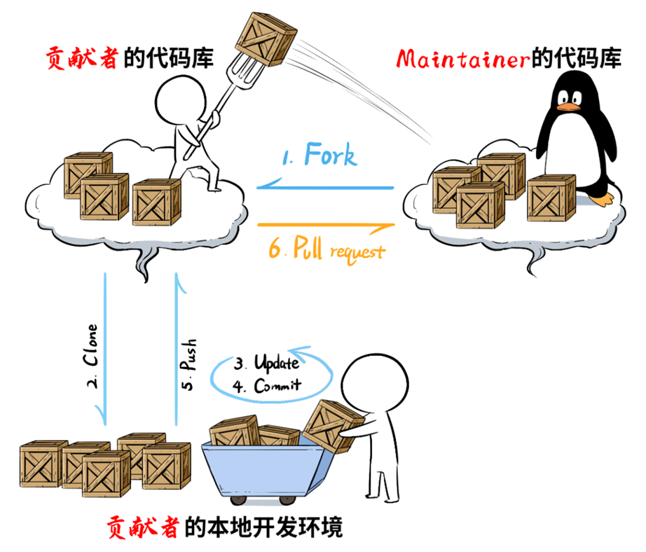

# How to submit a PR

Pull Request，在开源社区也常常被简称为PR，是自己修改源代码后，请求上游仓库采纳该修改时采取的一种行为。如上图，提交PR的流程简述如下：

1. 贡献者从社区官方代码库中fork一份代码到自己的库；
2. 将自己社区库中的代码clone到本地开发环境上；
3. 修改代码，解决bug或开发新feature；
4. 提交修改；
5. 将本地提交push到自己的社区库中；
6. 向社区官方代码库提交PR；
7. 待maintainer review后合入社区官方代码库。

以下是一些参考文档的链接：

- [openEuler开源社区贡献攻略](https://www.openeuler.org/zh/community/contribution/)
- [如何参与openEuler社区](https://gitee.com/openeuler/community/tree/master/zh/contributors)
- [PR提交指南](https://gitee.com/openeuler/community/blob/master/zh/contributors/pull-request.md)
- [Gitee工作流说明](https://gitee.com/openeuler/community/blob/master/zh/contributors/Gitee-workflow.md)