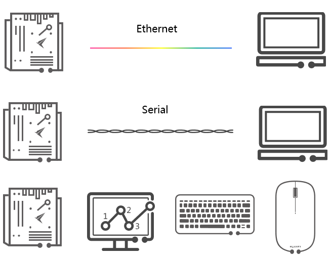
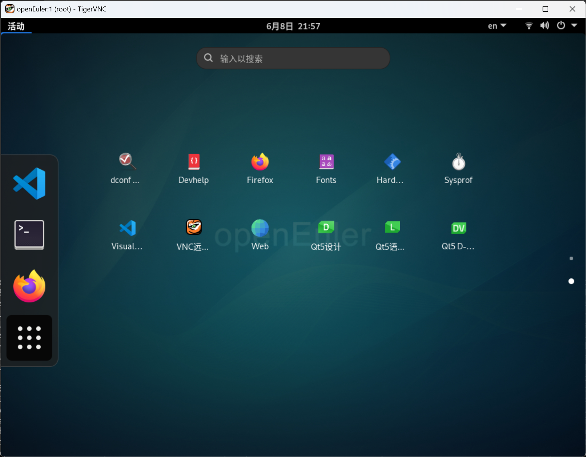
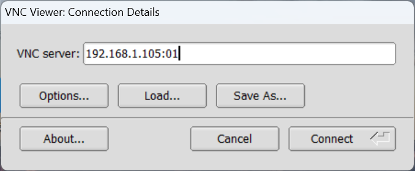
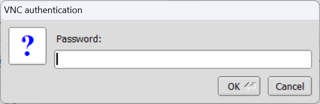

# Kunpeng Ascend Developer Conference

[**Kunpeng Developer Summit 2024**](https://www.hikunpeng.com/activities/kunpeng-developer-summit2024)


[中国北京，2024年5月9日] 以“鲲鹏原生，力算未来”为主题的[鲲鹏开发者峰会2024](https://www.hikunpeng.com/zh/activities/dynamic-news/456?id=456https://www.hikunpeng.com/zh/activities/dynamic-news/456?id=456)在北京中关村国际创新中心成功举办。大会旨在汇聚开发者、产业组织、生态伙伴和行业组织的创新力量，分享计算产业趋势与前沿技术，探索未来，共创非凡。

华为公司副总裁、ICT产品与解决方案总裁马海旭正式发布Kunpeng Pro。Kunpeng Pro是一块面向开发者的鲲鹏开发板，具有鲲鹏主板的完整能力，内置openEuler开源操作系统、openGauss开源数据库和鲲鹏开发套件DevKit，外置丰富接口，易于扩展，帮助开发者更快速、便捷的进行各种实践和创新。


## I 实验设备及其连接

本次大会以**[鲲鹏开发板](http://www.orangepi.cn/html/hardWare/computerAndMicrocontrollers/details/Orange-Pi-kunpeng.html)**为平台进行实验。



如上图所示，开发板与其他实验设备之间的连接方式有三：

- PC通过以太网和开发板相连
  - 利用PC机中的Console命令行终端通过以太网+TCP/IP+SSH登录系统（用`ssh`命令）
  - 通过VNC（Virtual Network Computing）登录系统

- PC通过串口（Serial）和开发板相连
  - 注意<u>鲲鹏开发板</u>串口的波特（Baud，symbol/s）为115200bps

- 开发板+显示器+键盘+鼠标相连


## II 登录系统

本实验在PC上以**ssh**命令通过“以太网+TCP/IP”登录系统。

🤚 <u>*动手操作*</u>

- 在Windows操作系统中按“ +R”打开命令窗，或者
- 按“ +X, i”打开Terminal（PowerShell)，或者
- 通过[“MobaXterm”软件](https://mobaxterm.mobatek.net/)选择使用SSH协议登录系统

输入以下`ssh`命令：

```shell
ssh openEuler@192.168.1.105
```

这里“openEuler”是用户名，*192.168.1.105*是开发板的IP地址，登录时要输入密码，密码也是“openEuler”。

🔒 <u>*安全*</u>

为系统安全起见，进行应用编程实验时，我们一般以非root用户登录，进行内核模块编程时，我们以root身份登录。


## III 进行实验

请根据实验指南进行实验。


## 附录A 安装Qt

如何在开发板上安装Qt开发环境？不妨假设您通过“以太网+TCP/IP”在一台PC上登录到开发板上的openEuler操作系统进行Qt GUI程式开发。在这种情形下，我们需要：
- 安装Qt
- 安装VNC

### 一、安装Qt

可以以以下命令安装Qt及其开发组件（以Qt5为例）：
```shell
yum install qt5 qt5-devel
```
安装完成后在鲲鹏开发板上“Applications”中会有如下显示（注意有关Qt的图标）：



以下命令适合更全面的安装：
```shell
yum install qt5*  # Total download size: 2.3 G; Installed size: 8.7 G
```

### 二、安装VNC

安装VNC（Virtual Network Console）是为了让PC通过“以太网+TCP/IP”登录到开发板的桌面系统。

由于openEuler操作系统的repo源中有tigervnc与tigervnc-server，因此就安装它们：
```shell
yum install -y tigervnc tigervnc-server
```

安装完毕后启动VNC Server：
```shell
vncserver
```
注意：如果是第一次启动，则需要设置和再次输入密码，按照提示设置和再次输入即可：
```

You will require a password to access your desktops.

Password:
Verify:
Would you like to enter a view-only password (y/n)? y
Password:
Verify:
```

可以确认是否启动：
```shell
vncserver -list
```

可能的输出如下：
```
TigerVNC server sessions:

X DISPLAY #     PROCESS ID
:1              2593
```

在用客户端进行连接之前需要检查VNC服务器（即开发板）上的防护墙是否开启：
```shell
systemctl status firewalld
```

如果防护墙处于开启状态则可以直接关闭防护墙：
```shell
systemctl stop firewalld
```

注意：由于是学生实验，所以可以简单关闭防火墙。若其他安全性比较高的场景，请参照如下命令：
```shell
firewall-cmd --zone=public --add-port=5900/tcp
```
VNC的默认端口是5900，远程桌面连接端口则是5900+n（n是vncserver命令指定的）。如果使用“vncserver”命令启动后“X DISPLAY”的端口号为“:1”，则其相应VNC Server端口号为则5901，其余以此类推。

最后请在Windows终端安装TigerVNC客户端并启动之：




在本例中假设开发板的IP地址为“<i>192.168.1.105</i>”，VNC Server端口号为<i>5901</i>（如果使用两位端口号格式，则在客户端输入的是“<i>01</i>”)，然后点击“Connect”按钮。

然后输入先前在服务器（即开发板）上第一次运行`vncserver`命令时所设置的密码并按“OK”按钮进行连接：



如果没有出什么差错，则会在PC上显示开发板上openEuler操作系统的桌面。

### 三、Hello, world!

现在是以一个简单的例子验证我们安装的Qt开发环境的时候了。

步骤1：创建工作目录并进入
```shell
mkdir -p ~/qt/helloworld/ && cd $_
```

步骤2：准备源代码
请参考本例所附helloworld.cpp源代码进行准备：

```shell
vim helloworld.cpp
```

步骤3：产生工程文件
```shell
qmake-qt5 -project
echo "QT += widgets" >> helloworld.pro
```

步骤4：编译源文件
```shell
qmake-qt5
make
```

步骤5：在桌面环境中运行
```shell
~/qt/helloworld/helloworld
```


步骤6：清理文件
```shell
cd ~/qt/helloworld/
find * | grep -v helloworld.cpp | xargs rm
```


## 附录B 软件包安装汇总

在开发板上进行一次比较全面的软件包安装以支持内核模块编程、系统环境实验以及Qt软件开发，可以参考以下命令：
```shell
yum group install "Development Tools"
yum install bc
yum install openssl-devel

yum install mlocate # for locate command

yum install qt5*
```

注意：如果在安装的过程中出现“Error: GPG check FAILED”错误则可在`yum install`命令后增加`--nogpgcheck`选项，例如：
```shell
yum group install -y "Development Tools" --nogpgcheck
```


## 附录C 术语表

本实验中所用术语列表如下：

🏷<u>*术语表*<u>

- PC
  - Personal Computer，个人电脑
- SSH
  - Secure Shell，安全外壳。一种网络安全协议，通过加密和认证机制实现安全的访问和文件传输等业务。
- VNC
  - Virtual Network Console，虚拟网络控制台
- TCP/IP
  - Transmission Control Protocol/Internet Protocol，传输控制协议/网际协议。其不仅仅指的是TCP和IP两个协议，而是指一个由TCP、IP、ARP（Address Resolution Protocol）、UDP（User Datagram Protocol）、HTTP（Hypertext Transfer Protocol）、FTP（File Transfer Protocol）、SMTP（Simple Mail Transfer Protocol）、Telnet等协议构成的协议簇，而尤其以TCP和IP最具代表性。