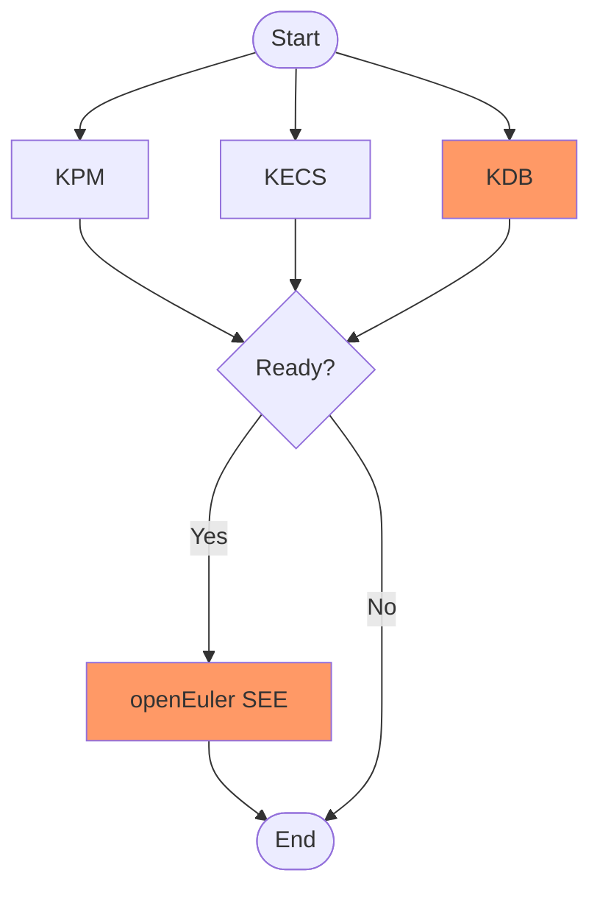

# openEuler系统环境实验

**openEuler System Environment Experiments**


## I 什么是系统环境实验

所谓**系统环境**，是指运行在一定硬件系统之上的操作系统所提供的软件运行环境，在本实验中特指运行于**鲲鹏处理器**之上的**openEuler操作系统 **向上层软件提供的运行环境。

窥探并研究系统环境的实验即为**系统环境实验**。从广泛的角度而言，内核编译、内核模块编程、系统编程（System Programming）都为系统环境实验提供了案例，但为初学者简单起见，本文探讨如下几个实验：

- 通过Linux shell命令查看系统信息
- 观察C语言char数据类型
- 体验aarch64架构精简指令集
- C代码中的汇编语句
- 纯汇编程序

💡 <u>*小知识*</u>

- **鲲鹏处理器**是华为基于ARMv8架构开发的通用处理器。作为一款现代处理器，在芯片内部架构中，鲲鹏处理器涉及到了体系结构中的SoC、Chip、DIE、Cluster以及Core等概念，从而组成了一个复杂的综合体。

- **openEuler**既是一个操作系统，又是一个开源、免费的Linux发行平台，其致力于打造中国原生开源、可自主演进操作系统根社区。作为操作系统，当前openEuler内核源于[Linux](https://www.kernel.org/)，支持鲲鹏及其他多种处理器。

🔗 <u>*学习资源*</u>

- [《openEuler操作系统》（第二版）](http://www.tup.tsinghua.edu.cn/booksCenter/book_09568001.html)“第2章 鲲鹏处理器”

- [openEuler门户网站](https://www.openeuler.org/zh/)
- [openEuler代码仓](https://gitee.com/openeuler/)
- [openEuler软件包仓](https://gitee.com/src-openeuler/)
- [高校子站](https://edu.hicomputing.huawei.com/)
- [鲲鹏生态官网](https://www.hikunpeng.com/)


## II 实验设备与实验流程


上图所用术语含义如下所示：

🏷 <u>*术语表*</u>

- KPM
  - Kunpeng Physical Machine，鲲鹏物理机
- KECS
  - Kunpeng Elastic Cloud Server，鲲鹏弹性云服务器
- KDB
  - Kunpeng Development Board，鲲鹏开发板
- SEE
  - System Environment Experiments，系统环境实验

### 一、实验设备

目前有三种鲲鹏平台可供选择：

- 鲲鹏物理机：包括基于鲲鹏处理器的PC机、服务器（如泰山2280物理服务器）等。
- 鲲鹏ECS：即基于鲲鹏处理器的华为云ECS（弹性云服务器，Elastic Cloud Server）。
- 鲲鹏开发板：类似于树莓派但是以鲲鹏处理器为CPU的开发板。

### 二、实验流程

实验流程如下：

1. 准备好一个“鲲鹏平台+openEuler操作系统”的实验环境
2. 登录到实验环境
3. 进行实验

登录到实验环境（操作系统）的方式：

- 通过本地终端登录系统，这里的本地终端包括键盘、鼠标（物理输入设备）和显示器（物理输出设备），适用于鲲鹏物理机、鲲鹏开发板。
- 通过串口登录系统，适用于鲲鹏开发板。
- 利用PC机中的Console命令行终端通过以太网+TCP/IP+SSH登录系统（用`ssh`命令），适用于鲲鹏物理机、鲲鹏ECS、鲲鹏开发板。

🔒 <u>*安全*</u>

为系统安全起见，进行应用编程实验时，我们一般以非root用户登录。

## III openEuler系统环境实验

### 一、查看系统信息

本实验通过Linux shell命令查看系统信息以增进对鲲鹏处理器和openEuler操作系统的了解。

#### 1. 查看系统架构信息

🤚 <u>*动手操作*</u>

```shell
uname -m # aarch64, i.e. arm64
uname -r
uname -a # ...... aarch64 GNU/Linux
```

以上一系列`uname`命令分别查看了系统的CPU架构、操作系统内核版本及其他信息。

⚛ <u>*进一步研究*</u>

试用“`uname --help`”命令探索更多选项。

#### 2. 查看CPU信息

🤚 <u>*动手操作*</u>

```shell
lscpu # ......
```

❓ <u>*回答问题*</u>

试着说出上述命令执行结果所代表的含义。

⚛ <u>*进一步研究*</u>

以下是在运行于泰山2280物理服务器（搭载鲲鹏920处理器）的openEuler操作系统中执行该命令的结果：

```
Architecture:                    aarch64
CPU op-mode(s):                  64-bit
Byte Order:                      Little Endian
CPU(s):                          128
On-line CPU(s) list:             0-127
Thread(s) per core:              1
Core(s) per socket:              64
Socket(s):                       2
NUMA node(s):                    4
Vendor ID:                       HiSilicon
Model:                           0
Model name:                      Kunpeng-920
Stepping:                        0x1
CPU max MHz:                     2600.0000
CPU min MHz:                     200.0000
BogoMIPS:                        200.00
L1d cache:                       8 MiB
L1i cache:                       8 MiB
L2 cache:                        64 MiB
L3 cache:                        256 MiB
NUMA node0 CPU(s):               0-31
NUMA node1 CPU(s):               32-63
NUMA node2 CPU(s):               64-95
NUMA node3 CPU(s):               96-127
Vulnerability Itlb multihit:     Not affected
Vulnerability L1tf:              Not affected
Vulnerability Mds:               Not affected
Vulnerability Meltdown:          Not affected
Vulnerability Spec store bypass: Vulnerable
Vulnerability Spectre v1:        Mitigation; __user pointer sanitization
Vulnerability Spectre v2:        Not affected
Vulnerability Tsx async abort:   Not affected
Flags:                           fp asimd evtstrm aes pmull sha1 sha2 crc32 atomics fphp asimdhp cpuid asimdrdm jscvt fcma dcpop asimddp asimdfhm
```

这里以L1、L2级缓存大小为例分析一下上面的数据。我们知道鲲鹏920处理器有L1、L2、L3三级cache，其中L1的指令cache（L1I）和数据cache（L1D）大小都是64KiB，L2 cache不区分指令或数据，大小为512KiB，L1和L2两级cache由各个CPU core独享。一颗鲲鹏920芯片包含64个core，故：
- L1d cache：64Kib x 64 = 4096Kib 即4MiB
- L1i cache：64Kib x 64 = 4096Kib 即4MiB
- L2 cache：512Kib x 128 = 32768Kib 即32MiB

在泰山2280 V2服务器有2个CPU socket，4个NUMA节点，总核数达到128个，故L1d/L1i cache大小分别是8MiB，L2 cache大小是64MiB。

#### 3. 查看操作系统版本

🤚 <u>*动手操作*</u>

```shell
cat /etc/os-release # ......
```

❓ <u>*回答问题*</u>

你能根据命令显示结果说出openEuler的版本号吗？

### 二、观察C语言char数据类型

C是一种“强类型、弱检查”的系统级通用编程语言，我们通过对比运行在aarch64和x64架构上C语言char默认数据类型的不同进一步了解硬/软件系统某一个小小环节的差异便可使上层应用产生截然不同的结果，从而从见微知著之处体会鲲鹏平台与其他平台的不同。

🔔 <u>*说明*</u>

本节实验所用源代码在“`code`”目录中。

#### 1. 检查GCC版本

🤚 <u>*动手操作*</u>

```shell
gcc --version # ......
```

推荐使用gcc7.3.0及以上版本（不低于4.8.5）。

#### 2. 准备C程序源代码

🎵 <u>*准备代码*</u>

请按`ch.c`的内容准备源代码，我们假设您放在操作系统Home目录的code目录下：

```shell
cd ~/code
```

#### 3. 编译并执行

在鲲鹏开发板上编译并执行：

🤚 <u>*动手操作*</u>

```shell
gcc ch.c
./a.out
```

以下是在鲲鹏平台上的执行结果：

```
sizeof ch is 1, 1

         char ch = ff, +255, positive

  signed char ch = ff,   -1, negative
unsigned char ch = ff, +255, positive
```

可以看出：

- 由于计算机中的整数用补码表示的原因，`-1`在内存中的数值是`0xff`
- 在鲲鹏平台上`char`的默认数据类型与`unsigned char`同

#### 4. 在x64平台上进行同样的实验

🤲 <u>*与x64平台比较*</u>

以下是在x64平台上的执行结果：

```
sizeof ch is 1, 1

         char ch = ff,   -1, negative

  signed char ch = ff,   -1, negative
unsigned char ch = ff, +255, positive
```

可见，在x64平台上，`char`的默认数据类型与`signed char`同。

⚛ <u>*进一步研究*</u>

其实，C语言标准并没有规定`char`应该是`unsigned char`还是`signed char`：

> “The C standards do say that "char" may either be a "signed char" or "unsigned char" and it is up to the compilers implementation or the platform which is followed.”

所以，在C语言中，`char`类型是不是就相当于`unsigned char`和`signed char`的泛型，仅仅代表一个8bit位数的集合，至于这个集合的具体含义（是`unsigned char`还是`signed char`），那是和C编译器与CPU指令集都有关的，可以看出：**信息就是上下文**。

❓ <u>*回答问题*</u>

你可以举出另外一些“信息就是上下文”的例子吗？

#### 5. 编译时指定char的类型

🤚 <u>*动手操作*</u>

```shell
gcc -fsigned-char ch.c
./a.out
```

看看这一次的结果是怎样的。

❓ <u>*回答问题*</u>

在软件行业有一个灵丹妙药，即“**再加一层**”，这里gcc编译时所带参数-f算不算是加了一层？

💡 <u>*小知识*</u>

> “All problems in computer science can be solved by another level of indirection, except for the problem of too many layers of indirection.”
> “计算机科学中的所有问题都可以通过另外一个分层来解决，除了太多间接分层的问题外。”
> ——Butler Lampson 1992年图灵奖获奖报告（其本人认为这句著名格言最早出自于David Wheeler）


### 三、体验aarch64架构精简指令集

由于鲲鹏处理器是基于aarch64架构的，故其采用的是精简指令集。

#### 1. 准备源代码

🎵 <u>*准备代码*</u>

请按`abc.c`的内容准备源代码，我们假设您放在操作系统Home目录的code目录下：

```shell
cd ~/code
```

#### 2. 编译然后反汇编

编译源文件并进行反汇编：

🤚 <u>*动手操作*</u>

```shell
gcc -g abc.c
./a.out
echo $? # Desire 6
objdump -S ./a.out
```

请查看在咱们所用鲲鹏平台（RISC）上反汇编的结果。

🤲 <u>*与x64平台比较*</u>

以下是在“x86_64 + openEuler 22.03 (LTS-SP3) + gcc (GCC) 10.3.1”平台上进行同样实验的结果：

```
gcc -g abc.c
objdump -S ./a.out

./a.out:     file format elf64-x86-64


Disassembly of section .init:

0000000000401000 <_init>:
  401000:       f3 0f 1e fa             endbr64
  401004:       48 83 ec 08             sub    $0x8,%rsp
  401008:       48 8b 05 e1 2f 00 00    mov    0x2fe1(%rip),%rax        # 403ff0 <__gmon_start__@Base>
  40100f:       48 85 c0                test   %rax,%rax
  401012:       74 02                   je     401016 <_init+0x16>
  401014:       ff d0                   call   *%rax
  401016:       48 83 c4 08             add    $0x8,%rsp
  40101a:       c3                      ret

Disassembly of section .text:

0000000000401020 <_start>:
  401020:       f3 0f 1e fa             endbr64
  401024:       31 ed                   xor    %ebp,%ebp
  401026:       49 89 d1                mov    %rdx,%r9
  401029:       5e                      pop    %rsi
  40102a:       48 89 e2                mov    %rsp,%rdx
  40102d:       48 83 e4 f0             and    $0xfffffffffffffff0,%rsp
  401031:       50                      push   %rax
  401032:       54                      push   %rsp
  401033:       45 31 c0                xor    %r8d,%r8d
  401036:       31 c9                   xor    %ecx,%ecx
  401038:       48 c7 c7 02 11 40 00    mov    $0x401102,%rdi
  40103f:       ff 15 9b 2f 00 00       call   *0x2f9b(%rip)        # 403fe0 <__libc_start_main@GLIBC_2.34>
  401045:       f4                      hlt
  401046:       66 2e 0f 1f 84 00 00    cs nopw 0x0(%rax,%rax,1)
  40104d:       00 00 00

0000000000401050 <_dl_relocate_static_pie>:
  401050:       f3 0f 1e fa             endbr64
  401054:       c3                      ret
  401055:       66 2e 0f 1f 84 00 00    cs nopw 0x0(%rax,%rax,1)
  40105c:       00 00 00
  40105f:       90                      nop

0000000000401060 <deregister_tm_clones>:
  401060:       48 8d 3d c1 2f 00 00    lea    0x2fc1(%rip),%rdi        # 404028 <__TMC_END__>
  401067:       48 8d 05 ba 2f 00 00    lea    0x2fba(%rip),%rax        # 404028 <__TMC_END__>
  40106e:       48 39 f8                cmp    %rdi,%rax
  401071:       74 15                   je     401088 <deregister_tm_clones+0x28>
  401073:       48 8b 05 6e 2f 00 00    mov    0x2f6e(%rip),%rax        # 403fe8 <_ITM_deregisterTMCloneTable@Base>
  40107a:       48 85 c0                test   %rax,%rax
  40107d:       74 09                   je     401088 <deregister_tm_clones+0x28>
  40107f:       ff e0                   jmp    *%rax
  401081:       0f 1f 80 00 00 00 00    nopl   0x0(%rax)
  401088:       c3                      ret
  401089:       0f 1f 80 00 00 00 00    nopl   0x0(%rax)

0000000000401090 <register_tm_clones>:
  401090:       48 8d 3d 91 2f 00 00    lea    0x2f91(%rip),%rdi        # 404028 <__TMC_END__>
  401097:       48 8d 35 8a 2f 00 00    lea    0x2f8a(%rip),%rsi        # 404028 <__TMC_END__>
  40109e:       48 29 fe                sub    %rdi,%rsi
  4010a1:       48 89 f0                mov    %rsi,%rax
  4010a4:       48 c1 ee 3f             shr    $0x3f,%rsi
  4010a8:       48 c1 f8 03             sar    $0x3,%rax
  4010ac:       48 01 c6                add    %rax,%rsi
  4010af:       48 d1 fe                sar    %rsi
  4010b2:       74 14                   je     4010c8 <register_tm_clones+0x38>
  4010b4:       48 8b 05 3d 2f 00 00    mov    0x2f3d(%rip),%rax        # 403ff8 <_ITM_registerTMCloneTable@Base>
  4010bb:       48 85 c0                test   %rax,%rax
  4010be:       74 08                   je     4010c8 <register_tm_clones+0x38>
  4010c0:       ff e0                   jmp    *%rax
  4010c2:       66 0f 1f 44 00 00       nopw   0x0(%rax,%rax,1)
  4010c8:       c3                      ret
  4010c9:       0f 1f 80 00 00 00 00    nopl   0x0(%rax)

00000000004010d0 <__do_global_dtors_aux>:
  4010d0:       80 3d 51 2f 00 00 00    cmpb   $0x0,0x2f51(%rip)        # 404028 <__TMC_END__>
  4010d7:       75 17                   jne    4010f0 <__do_global_dtors_aux+0x20>
  4010d9:       55                      push   %rbp
  4010da:       48 89 e5                mov    %rsp,%rbp
  4010dd:       e8 7e ff ff ff          call   401060 <deregister_tm_clones>
  4010e2:       c6 05 3f 2f 00 00 01    movb   $0x1,0x2f3f(%rip)        # 404028 <__TMC_END__>
  4010e9:       5d                      pop    %rbp
  4010ea:       c3                      ret
  4010eb:       0f 1f 44 00 00          nopl   0x0(%rax,%rax,1)
  4010f0:       c3                      ret
  4010f1:       66 66 2e 0f 1f 84 00    data16 cs nopw 0x0(%rax,%rax,1)
  4010f8:       00 00 00 00
  4010fc:       0f 1f 40 00             nopl   0x0(%rax)

0000000000401100 <frame_dummy>:
  401100:       eb 8e                   jmp    401090 <register_tm_clones>

0000000000401102 <main>:
//
// gcc -g abc.c
// objdump -S ./a.out
//

int main() {
  401102:       55                      push   %rbp
  401103:       48 89 e5                mov    %rsp,%rbp
    int a = 1;
  401106:       c7 45 fc 01 00 00 00    movl   $0x1,-0x4(%rbp)
    int b = 2;
  40110d:       c7 45 f8 02 00 00 00    movl   $0x2,-0x8(%rbp)
    int c = a + b;
  401114:       8b 55 fc                mov    -0x4(%rbp),%edx
  401117:       8b 45 f8                mov    -0x8(%rbp),%eax
  40111a:       01 d0                   add    %edx,%eax
  40111c:       89 45 f4                mov    %eax,-0xc(%rbp)

    return a+b+c;
  40111f:       8b 55 fc                mov    -0x4(%rbp),%edx
  401122:       8b 45 f8                mov    -0x8(%rbp),%eax
  401125:       01 c2                   add    %eax,%edx
  401127:       8b 45 f4                mov    -0xc(%rbp),%eax
  40112a:       01 d0                   add    %edx,%eax
}
  40112c:       5d                      pop    %rbp
  40112d:       c3                      ret

Disassembly of section .fini:

0000000000401130 <_fini>:
  401130:       f3 0f 1e fa             endbr64
  401134:       48 83 ec 08             sub    $0x8,%rsp
  401138:       48 83 c4 08             add    $0x8,%rsp
  40113c:       c3                      ret
```

❓ <u>*回答问题*</u>

观察两者的机器码，你能说出精简指令集和复杂指令集各自的特点吗？

### 四、C代码中的汇编语句

#### 1. 准备源代码

🎵 <u>*准备代码*</u>

请按`add.c`的内容准备源代码，我们假设您放在操作系统Home目录的code目录下：

```shell
cd ~/code
```

#### 2. 编译并执行

🤚 <u>*动手操作*</u>

```shell
gcc -o add add.c
./add 2 3 # Desire 5
```

⚛ <u>*进一步研究*</u>

试着将代码中32位的寄存器Wn换成64位的寄存器Xn再重新编译运行一遍。

### 五、纯汇编程序

#### 1. 准备汇编代码

🎵 <u>*准备代码*</u>

请按`hello.s`的内容准备源代码，我们假设您放在操作系统Home目录的code目录下：

```shell
cd ~/code
```

#### 2. 编译、链接

🤚 <u>*动手操作*</u>

```shell
as -o hello.o hello.s
ld -o hello hello.o
```

#### 3. 执行

🤚 <u>*动手操作*</u>

```shell
./hello # Hello openEuler!
```

⚛ <u>*进一步研究*</u>

试着弄懂上述程序中汇编代码的含义。


## IV 术语表

本实验中所用术语列表如下：

🏷 术语表

- PC
  - Personal Computer，个人电脑
- ECS
  - Elastic Cloud Server，弹性云服务器
- SoC
  - System on Chip，片上系统
- Chip
  - 通常指一块物理芯片
- DIE
  - 芯片的最小物理单元
- Cluster
  - 族，若干个core的集合
- Core
  - 核，真正负责做计算的单元
- RISC
  - Reduced Instruction Set Computer，精简指令集计算机
- CISC
  - Complex InstrucTIon Set Computer，复杂指令集计算机
- NUMA
  - Non-Uniform Memory Access，非统一内存访问
- SSH
  - Secure Shell，安全外壳。一种网络安全协议，通过加密和认证机制实现安全的访问和文件传输等业务。

