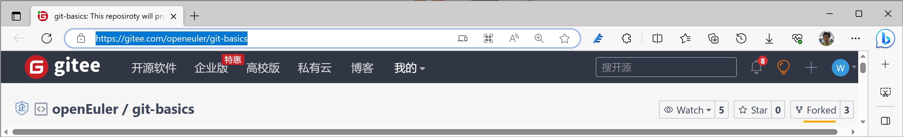

# How to experience this practice


## 准备工作

1. [注册Gitee账号](https://gitee.com/signup)并设置好**提交邮箱**。

   通常，可以在自己个人主页的URL（统一资源定位符，Uniform Resource Locator）中查看**Gitee账号**（即**Gitee ID**），如下例所示：

   

   

   可以到“设置 | 邮箱管理”页面中查看自己的**提交邮箱**，如下例所示：

   

   

2. [签署个人CLA](https://clasign.osinfra.cn/sign/Z2l0ZWUlMkZvcGVuZXVsZXI=)。

   

   注意：签署CLA的邮箱地址应该与Gitee账号关联的**提交邮箱**地址保持一致。

   

3. 参考[Git官网](https://git-scm.com/downloads)安装好git工具软件。

   

   注意：如果您已经有了可以使用Git工具软件的命令行/图形环境（如Linux、macOS等），则可以略过这一步。

   

4. 在自己的PC机上配置好git账号，譬如：

   ```shell
   git config --global user.name  "woodrabbit" # 请设置成您自己的Gitee-ID
   git config --global user.email "woodrabbit@qq.com" # 请设置成您自己和Gitee-ID关联的提交邮箱
   git config --global list # 查看设置
   ```


## 提交PR

1. 将[此实验的上游仓库](https://gitee.com/openeuler/git-basics)fork到自己的Gitee账号下。

   

   

2. 将自己Gitee账号下的这个远程（remote）仓库“git clone”到本地PC。

   ```shell
   # 注意：请从您自己的远程仓库上下载
   git clone https://gitee.com/woodrabbit/git-basics.git
   cd git-basics
   git branch
   git status # On branch master
   ```

   

3. 创建自己的新分支。

   ```shell
   git switch -c woodrabbit # 注意：请以自己Gitee-ID为名创建分支
   git branch
   git status # On branch woodrabbit
   ```

   

4. 进入我们这个实验的工作目录并以自己的Gitee-ID为名建立空文件。

   ```shell
   cd ./pr/primary/ # 我们的修改都在这个目录进行，并且注意不要修改该目录下的其他文件
   cd . > woodrabbit # 以此方法建立以自己Gitee-ID为名的空文件
   ```

   

5. 将此文件加入git暂存区并提交到本地仓库。

   ```shell
   git add woodrabbit # 把以自己Gitee-ID命名的文件加入git暂存区
   git commit -s -m "Add woodrabbit" # 添加了一个以自己Gitee-ID命名的文件
   ```

   

6. 将此提交推送（**push**）到自己的远程仓库。

   ```shell
   git push # 第一次push时，这个命令会报错
   # 第一次push时，将以自己Gitee-ID命名的本地、当前分支与远程分支关联
   git push --set-upstream origin woodrabbit
   git status # 查看本地仓库当前状态
   git log # 查看提交历史
   ```

   

7. 在自己远程仓库的页面中新建PR，请求(**request**)上游仓库的master分支拉取（**pull**）自己新建分支（本例为*woodrabbit*）的更新。

8. [在上游仓库中查看](https://gitee.com/openeuler/git-basics/pulls)自己提交的PR并等待maintainer进行合入。


## 如何运行仓库中的程序

可以运行仓库中的main.c程序以观看提交后的效果。该main程序可以在Linux和类UNIX的macOS上运行。在Windows上，您可以看一下[openEuler开源创新实践课](https://gitee.com/openeuler/lfs-course/tree/master/lfs-7.7-systemd)中是如何创建虚拟机并安装openEuler操作系统以运行程序的。编译和运行该程序的命令如下所示：

```shell
cd pr/primary/src/
gcc main.c
./a.out
```

这样，凡是正确提交并被合入PR了的Gitee ID都可以在电脑屏幕上被打印出来……:)


## 附1：Git参考书籍

- [英文版](https://git-scm.com/book/en/v2)
- [简体中文版](https://git-scm.com/book/zh/v2)
- [繁体中文版](https://git-scm.com/book/zh-tw/v2)
