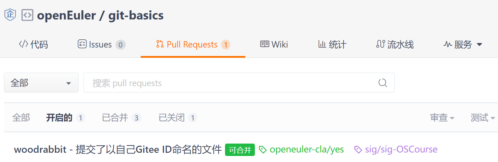

# How to submit a PR


**Pull Request**，即“拉取请求”，在开源社区也常常被简称为**PR**，是自己修改源代码后，请求上游仓库采纳该修改时采取的一种行为。如上图，提交PR的流程简述如下：

1. 贡献者从社区官方代码库中fork一份代码到自己的库；
2. 将自己社区库中的代码clone到本地开发环境上；
3. 修改代码，解决bug或开发新feature；
4. 提交修改；
5. 将本地提交push到自己的社区库中；
6. 向社区官方代码库提交PR；
7. 待maintainer review后合入社区官方代码库。

下文对如何提交PR进行详细说明。


## I 注册账号并签署CLA


1. [注册Gitee账号](https://gitee.com/signup)并设置好**提交邮箱**

   通常，可以在自己个人主页的URL（统一资源定位符，Uniform Resource Locator）中查看**Gitee账号**（即**Gitee-ID**），如下例所示：

   

   可以到“设置 | 邮箱管理”页面中查看自己的**提交邮箱**，如下例所示：

   

2. [签署个人CLA](https://clasign.osinfra.cn/sign/Z2l0ZWUlMkZvcGVuZXVsZXI=)

   

   CLA，全称Contributor License Agreement（贡献者许可协议），简单来说就是项目接收贡献者提交的Pull Request之前，需要贡献者签署的一份协议，协议只需签署一次，对该贡献者的所有提交都生效。
   
   请注意：签署CLA的邮箱地址应该与Gitee账号关联的**提交邮箱**地址保持一致。


## II 准备好git工具软件


1. 参考[Git官网](https://git-scm.com/downloads)安装好git工具软件

   

   其他使用git工具软件的方法：(1) 在Windows操作系统下，您可以通过[Oracle VM VirtualBox](https://www.virtualbox.org/)创建虚拟机，安装openEuler或其他Linux操作系统以运行Git。(2) 在一个现成的Linux/macOS操作系统下，也许您可以通过命令行直接使用git。(3) 在[华为云](https://www.huaweicloud.com/)（或其他可信的云环境）上购买一台ECS（Elastic Cloud Server，弹性云服务器）并在其Linux操作系统上使用git命令。

2. 配置好git账号

   譬如：

   ```shell
   git config --global user.name  "woodrabbit" # 请设置成您自己的Gitee-ID
   git config --global user.email "woodrabbit@qq.com" # 请设置成您自己和Gitee-ID关联的提交邮箱
   git config --global --list # 查看设置
   ```


## III 准备好代码


1. 将本例的[上游仓库](https://gitee.com/openeuler/git-basics)fork到自己的Gitee账号下

   

   点击该仓库页面右上角的“fork”按钮即可fork。本例fork到了一个叫“*woodrabbit*”的账号下（您应该fork到自己的账号下）：

   
   
   应该是很快的，该仓库就会出现在自己的主页下：
   
   
   
   
   小提示：如果之前已经fork该仓库代码又想要删除后重新fork，则可以先进入自己的仓库，然后进入“Settings（设置）”页面，点击左侧导航栏的“Delete（删除）”链接，在确认该删除操作后通过密码校验后即可删除该仓库。
   
   在Gitee页面上fork完毕后，就可以将这个仓库clone到本地了。


2. 将自己Gitee账号下的这个远程（remote）仓库clone到本地

   ```shell
   # 注意：请从您自己的远程仓库上下载
   git clone https://gitee.com/woodrabbit/git-basics.git
   cd git-basics
   git branch
   git status # On branch master
   ```
   
3. 创建自己新的（开发）分支

   ```shell
   git switch -c woodrabbit # 这里是以自己Gitee-ID为名创建了分支
   git branch
   git status # On branch woodrabbit
   ```
   
   注意：通常，我们会新建一个开发分支进行开发。开发分支的名称随意，通常取名为dev、develop、development等，本例中我们将开发分支设置成了自己Gitee-ID的名称。


4. 以自己的Gitee-ID为名建立空文件

   ```shell
   cd ./primary/pr/ # 我们的修改都在这个目录进行，并且注意不要修改该目录下的其他文件
   cd . > woodrabbit # 以此方法建立以自己Gitee-ID为名的空文件
   ```
   
   说明：`cd .`表示改变当前目录为当前目录，等于没有改变，故该操作不会有任何输出，将不会有任何输出的输出重定向到一个文件即创建了以该文件名为名的空文件——这种创建空文件的方法对Windows和类Linux操作系统都适用。为什么只创建空文件呢？因为本例不需要文件有内容。


5. 将此文件加入git暂存区并提交到本地仓库

   ```shell
   git add woodrabbit # 把以自己Gitee-ID命名的文件加入git暂存区
   git commit -s -m "Add woodrabbit file" # 添加了一个以自己Gitee-ID命名的文件
   ```


6. 将此提交推送（push）到自己的远程仓库

   ```shell
   git push
   ```
   
   但是第一次直接push时会报错，提示要用以下命令：
   ```shell
   # 第一次push时，将以自己Gitee-ID命名的本地、当前分支与远程分支关联
   git push --set-upstream origin woodrabbit # 将“woodrabbit”替换成自己的账号提交
   ```
   
   注意：(1) 在这个过程中需要输入自己的Gitee账号及其登录密码（输入密码时屏幕上不会有任何回显）。(2) 如果后续还有committed的内容要推送到远端仓库的话，直接用`git push`命令就行了。
   
7. 查看本地仓库状态及提交历史

   ```shell
   git status
   git log
   ```


## IV. 提交PR


按前述步骤`push`之后，刷新自己远程仓库的页面，就会出现刚刚新建的分支（本例为*woodrabbit*）：


鼠标点击这个分支就可以切换到这个分支。

以下步骤提交PR：


1. 新建Pull Request

   
   

   点击“Pull Requests”链接，然后点击“New Pull Request”按钮以新建Pull Request：

   


2. 切换到自己新创建的分支提交PR

   

   选中自己新建的分支（本例是*woodrabbit*分支）并将之合并到上游仓库的master分支。
   
   填写标题文字和注释，比如标题可以这样写（这个例子将Gitee-ID置于句首是为了方便审阅者看清是谁提交了PR。注意*woodrabbit*要改成自己的Gitee-ID）：
   
   *woodrabbit - 提交了以自己Gitee-ID命名的文件*
   
   注释可以说明此次提交做了哪些改动（及原因）。简单起见，本例可以这样写：
   
   *提交了以自己Gitee-ID（woodrabbit）命名的文件。*

   为什么要以自己的Gitee-ID命名文件呢？因为这样可以保证提交的文件不重名，代码合入时就不会引发冲突。另外，运行该仓库中的主程序就会将自己的ID打印出来。
   
   然后点击右下角的“Create（创建）”按钮进行提交。

   提交成功后上游远程仓库的[“Pull Requests”页面](https://gitee.com/openeuler/git-basics/pulls)将会显示这个PR：
   
   

   下图展示了另一次提交PR的例子仅供参考：
   
   
   

这时作为社区的一个contributor，您的作业已经提交完毕。如果您提交的是代码，系统一般会自动进行test。接下来要等待社区的committer进行review，如果合乎要求，他/她会进行`/lgtm`动作。之后就需要社区的maintainer进行最后确认，如果一切顺利，他/她会进行`/approve`动作，这之后，您的作业（或代码）就会合到上游远程仓库里去。关于这些流程的具体命令及其含义可以参考以下文档进行了解：

https://clasign.osinfra.cn/sign/Z2l0ZWUlMkZvcGVuZXVsZXI=
https://gitee.com/openeuler/community/blob/master/zh/contributors/Gitee-workflow.md
https://gitee.com/openeuler/community/blob/master/en/sig-infrastructure/command.md


## V 运行本仓库中的程序


可以运行仓库中的main.c程序以观看提交后的效果。该main程序可以在Linux和类UNIX的macOS上运行。在Windows上，您可以看一下[openEuler开源创新实践课](https://gitee.com/openeuler/lfs-course/tree/master/lfs-7.7-systemd)中是如何创建虚拟机并安装openEuler操作系统以运行程序的。编译和运行该程序的命令如下所示：

```shell
cd primary/pr/src/
gcc main.c
./a.out
```

这样，凡是正确提交并被合入PR了的Gitee-ID都可以在电脑屏幕上被打印出来……:)


## VI 思考题

<u>思考题1</u>：如何给上游开源仓库贡献代码？

参考答案：如果想给上游开源仓库贡献代码，通常是先fork别人的项目到个人远端仓库，然后在本地修改并提交代码到自己的远端仓库，最后提交PR等待别人合入自己的代码。

<u>思考题2</u>：如何写一个好的PR？
参考答案：

1. 一个PR对应一个事情，不要把不同的事情放在一个PR中，保持PR的干净整洁。
2. PR首要是说清楚why，就是原因，为什么会有这个PR，这个PR解决了什么问题。
3. PR中的描述要清晰明了，讲清楚commit中的要点是什么。
4. 一般来说，一个PR必须要有一个issue对应，这样才能形成需求和开发代码之间的对应关系（任何进入代码仓的内容是需要有原因的）。


## 附录A 缩略语


本文所用缩略语如下所示：

- PR
  - Pull Request，拉取请求。在有的系统里面又叫MR（Merge Request，合并请求）
- CLA
  - Contributor License Agreement，贡献者许可协议
- URL
  - Uniform Resource Locator，统一资源定位符
- PC
  - Personal Computer，个人电脑
- ECS
  - Elastic Cloud Server，弹性云服务器


## 附录B Git参考书籍


- [英文版](https://git-scm.com/book/en/v2)
- [简体中文版](https://git-scm.com/book/zh/v2)
- [繁体中文版](https://git-scm.com/book/zh-tw/v2)


## 附录C 其他参考链接


- [openEuler开源社区贡献攻略](https://www.openeuler.org/zh/community/contribution/)
- [如何参与openEuler社区](https://gitee.com/openeuler/community/tree/master/zh/contributors)
- [PR提交指南](https://gitee.com/openeuler/community/blob/master/zh/contributors/pull-request.md)
- [Gitee工作流说明](https://gitee.com/openeuler/community/blob/master/zh/contributors/Gitee-workflow.md)
- [openEuler赛题辅导之一个成功的码农从一个合格的PR开始](https://bbs.huaweicloud.com/live/kunpeng_live/202107221930.html)
