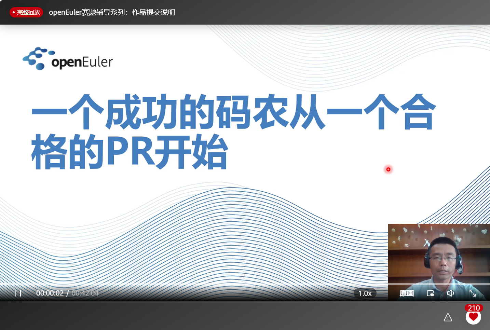
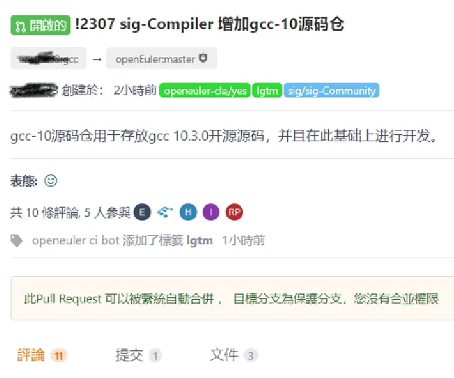
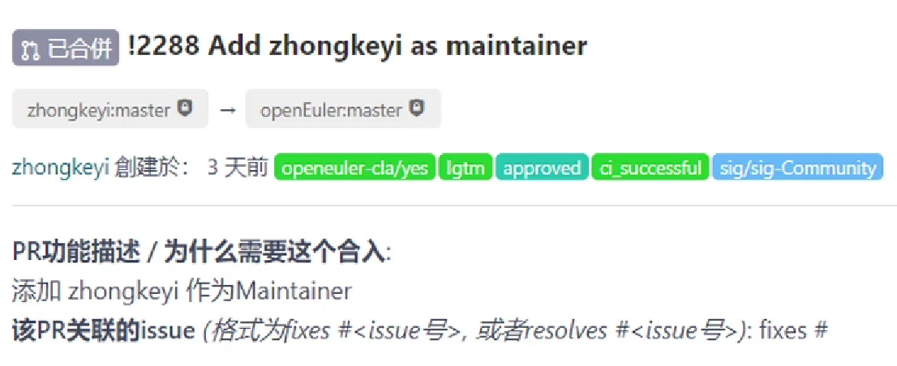
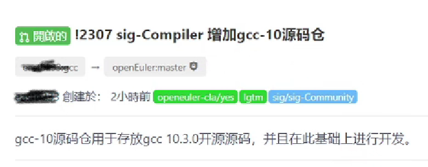
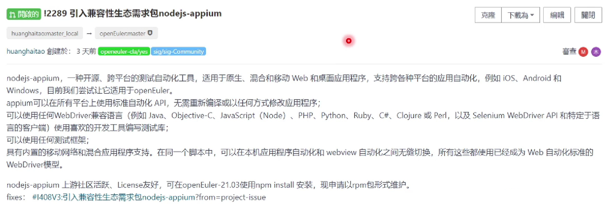
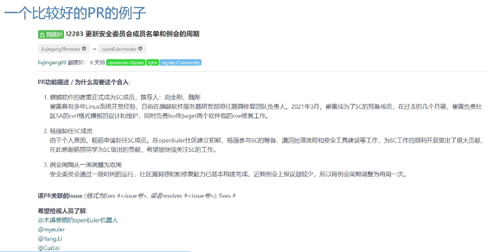

# 一个成功的码农从一个合格的PR开始

说明：本文仅为摘要，完整的内容请看“<u>openEuler赛题辅导系列：作品提交说明</u>”之“[一个成功的码农从一个合格的PR开始](https://bbs.huaweicloud.com/live/kunpeng_live/202107221930.html)”讲座视频。

“一个成功的码农是从一个合格的PR开始的。”

## I 什么是PR

所谓PR，即Pull Request，拉取需求，在有些系统/项目中叫MR，即Merge Request，其本质上是我们最后提交（代码）的一个request（要求，请求）。

如上图所示，PR主要由以下几个部分组成：
1. 题目
2. 内容
3. 评论、提交信息、文件信息等。

## II PR是开源世界的基石

PR是开源世界大规模软件开发的基石，也是其最重要的流程点。

为什么PR如此重要？是因为：
- 它是质量保证体系的基石。PR是真正合入代码和更新的入口，直接影响到最终交付件的质量。
- 它是大规模协作开发的基石。在一个互相不见面的“虚拟世界”，PR几乎是大家交流最重要的通道和“语言”。
- 它是社区历史的记录。PR不会被删除（除非它所在的仓库被彻底删除），每一个PR都记录在了社区历史中，是社区文化的传承载体之一。

下面让我们先来看几个“糟糕”的PR。

<u>**Bad PR Example 1**</u>

这个PR主要的问题是无信息量，试问：
- 说要加入这位maintainer，但是为什么要加的是他而不是其他人？
- 提交这个PR时该SIG项目不多，为什么要引入这么多maintainer？
- 新加入的这个maintainer后续在项目中的分工和作用是什么？

在后面的comment中提交者把这些信息都补全了，所以该PR最终被合入了。但是单看这个PR本身，这是个非常不合格的PR。

<u>**Bad PR Example 2**</u>

这个PR比第一个例子要好一点——题目写的很清楚，在描述中也做了部分解释。但审批者看到这个PR“先天”会提出以下问题：
- 为什么要这样建仓？我们对gcc版本10是重量级的开发么？
- 需不需要像kernel那样的组织形式？如果类似内核，那应该只有gcc这样的仓而通过分支来进行版本区分，而不是像这样一个版本一个仓。

所以对这些自然会遇到的问题在提交PR时就应有所解释。

<u>**PR Example 3**</u>

这是一个“接近完美”的PR：
- 题目写得非常清晰：引入一个软件包。
- 主体内容对这个包做什么做了详细的解释，同时说明了上游社区活跃、Licence友好等情况。

但是，审批的人会问如下问题：

什么业务需要引入这个软件，不能只说这个软件好，“好”软件成千上万，为什么要蛋蛋引入这个？它和我们这个项目有什么关系？

当然，（如上图所示）提交者在后面把信息补全了。

糟糕的PR会对世界产生什么影响呢？
- 极大地降低工作效率，增加无谓的资源消耗。
- 延长审批时间，使提交者和审批者双向不满。
- 影响产品交付质量。

## III 如何写一个合格的PR

那么，如何写一个好的PR？
1. 一个PR对应一个事情，不要把不同的事情放在一个PR中，保持PR的干净整洁。
2. PR首要是说清楚why，就是原因，为什么会有这个PR，这个PR解决了什么问题。
3. PR中的描述要清晰明了，讲清楚commit中的要点是什么。
4. 一般来说，一个PR必须要有一个issue对应，这样才能形成需求和开发代码之间的对应关系。任何进入代码仓的内容是需要有原因的。

<u>**Good PR Example**</u>

这是一个比较好的PR的例子：
- 题目清晰。
- 内容的可读性好，比如说是分了3个部分，每个部分做什么讲的非常清晰。
- 还注明了希望谁来检视。

需要说明的一点是，虽然以上用来演示的PR都是TC管理的PR（如建仓、管理流程等），更多偏向于技术审批类，但代码提交、特性开发、问题修正、文档写作等的PR，其本质要求都是一样的。

## IV 结束语

PR是码农成功的开始——一个PR写的好的码农未必能成长为一个伟大的码农，但是一个PR写不好的码农注定无法成为一个伟大的码农——让我们从写好每一PR开始吧！

## 附录A 术语表

- PR
  - Pull Request，拉取请求
- MR
  - Merge Request，合并请求
- TC
  - Technical Committee，技术委员会

## 附录B 一些较差的PR及评审者的回复

以下列出了一些比较差的PR及评审者的回复，大家可以从中学习。

没有清理干净提交，含有无意义的文件
https://gitee.com/openeuler/community/pulls/1848 

简单覆盖diff
https://gitee.com/src-openeuler/python-zeroconf/pulls/2

依赖关系的建立，先要找全依赖，再提交主包
https://gitee.com/src-openeuler/python-zope-interface/pulls/7

没有空行，可读性差
https://gitee.com/src-openeuler/perl-String-Util/pulls/1

无效的URL
https://gitee.com/src-openeuler/python-adb-shell/pulls/1

没有获取最新的版本
https://gitee.com/src-openeuler/python-fisx/pulls/1

一个事情分成了不同的PR提交
https://gitee.com/openeuler/community/pulls/2496

马虎大意的issue
https://gitee.com/open_euler/dashboard?issue_id=I42IR8

maintainer zyp委托xuxiaosong进行了review,但是谁知道这些信息?
https://gitee.com/openeuler/community/pulls/2548

没有在老的PR上修改，新开PR，导致信息缺失。
https://gitee.com/openeuler/community/pulls/2559
https://gitee.com/openeuler/community/pulls/2556

myeuler 成员 2021年08月10日
不要粗暴的关闭PR,应该在老的PR上修正,新开一个之前的评论信息全都丢失了.
以后PR要按照这个原则来搞.

完全覆盖式的PR
https://gitee.com/src-openeuler/python-astroid/pulls/5

并没有检视最新的github的版本，只是采用了pypi中的版本
https://gitee.com/src-openeuler/python-pure-sasl/pulls/1

master软件引入老版本分支。
https://gitee.com/openeuler/community/pulls/2616

conflict命令的引入
https://gitee.com/openeuler/community/pulls/2583

changelog的描述”正确但无用“
https://gitee.com/src-openeuler/memleax/pulls/8
https://gitee.com/src-openeuler/perl-Unicode-LineBreak/pulls/6
